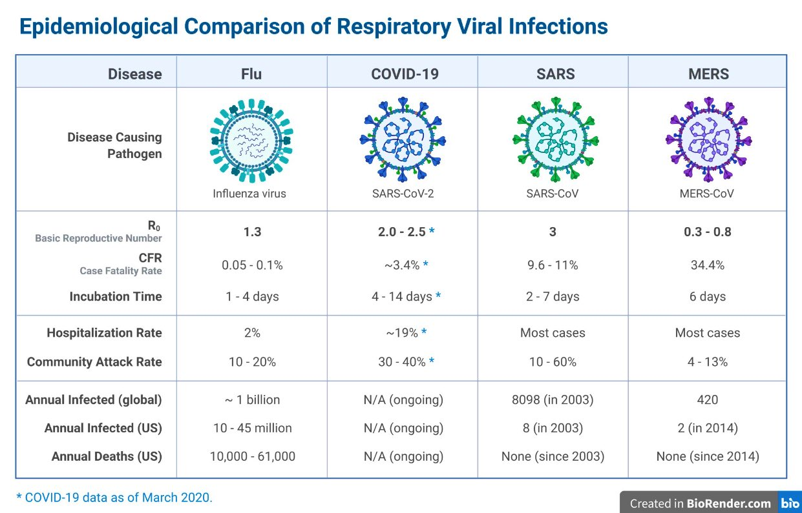

<h1 align='center'>COVID-19 (SARS-CoV-2) Global Pandemic</h1><!--⇧⌘V-To Preview-->

**Visit my [Online Portfolio](https://Ohmarr.github.io)**

<h2 align='center'>Details will be added here</h2>

**Datasets:**
 - Aggregated Daily [Data on OpenBlender](https://www.openblender.io/#/dataset/explore/5e6ac97595162921fda18076/or/35)
 - [github](https://github.com/CSSEGISandData/COVID-19/) account hosting Original Data Sources (Added Daily)
 - Useful [blog](https://towardsdatascience.com/gather-all-the-coronavirus-data-with-python-19aa22167dea) to help you get started
 - If you are a novice & need some guidance beyond the previous blog, please reach out to me
